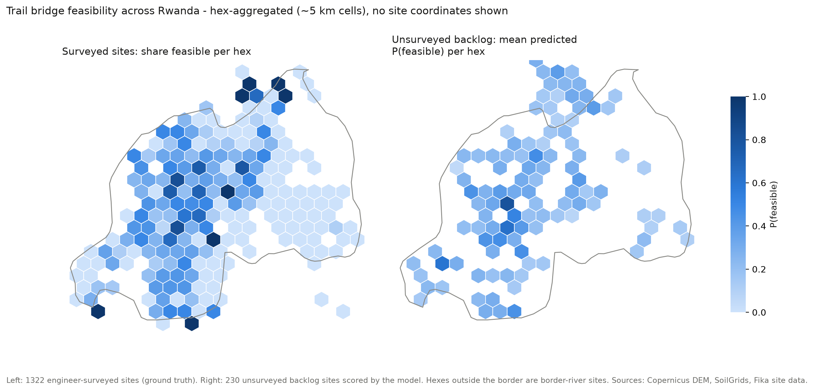
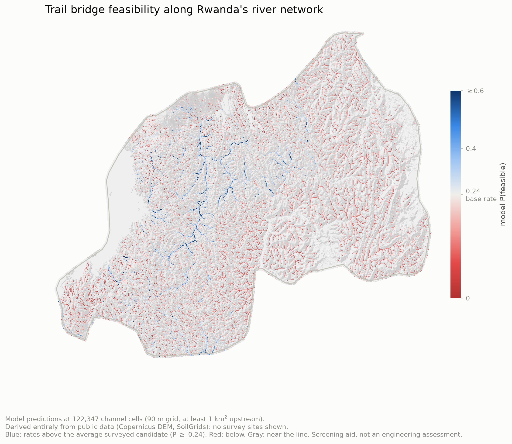

# Screening Bridge Sites from Satellite Data: First Results

Allan Gongora, September 2026 (revised after the second modeling round)

## Summary

I built a model that ranks prospective trail bridge sites by how likely they are to pass a technical feasibility survey. It uses only free, public satellite-derived data: no site visits, no imagery licenses. Tested honestly on regions the model never trained on, its top 100 picks in Rwanda contain roughly 2.6 to 2.9 times as many feasible sites as random selection. A model trained only on Rwanda transfers to Uganda well: on 80 held-out Ugandan sites, 15 of its top 20 picks are truly feasible. The transfer improved materially when I added two flood-hydraulics measurements (height of the banks above the channel, and channel steepness), which travel across countries better than soil or elevation do.

If engineers survey sites in the model's order instead of arbitrary order, the same number of trips confirms roughly 2.6 times as many buildable sites.

## What the model uses

Every input comes from public global datasets, so any candidate site on Earth can be scored:

- **Terrain** from the Copernicus 30 m elevation model: valley depth, slopes, crossing width, roughness.
- **Hydrology** derived from that same elevation data: upstream drainage area (how much land drains through the crossing, therefore how large the river is; the strongest single predictor, and it finds every stream channel, including the ones missing from river maps), bank height above the channel (flood exposure), and channel steepness (fast water and scour).
- **Soil** from the SoilGrids global database: texture, density, and depth to bedrock, which relate to foundations and anchors.

## What I tested and rejected, and why that matters

Every candidate input faced the same statistical bar: it stays only if the improvement is clearly distinguishable from luck on held-out districts. Four candidates failed that bar, and each failure is informative:

- **WaterNet** (your published water map). Head-to-head against elevation-derived hydrology, elevation wins decisively. WaterNet answers "where is water"; feasibility runs on "how much land drains through here," which it does not carry. It remains excellent for other purposes, and I cite it, but it did not improve this model.
- **40 years of Landsat surface-water observations** (JRC Global Surface Water). It detects water at only 2% of these sites: the streams are too small and too canopy-covered for Landsat. Observed flood extent is a dead end at trail bridge scale.
- **Rainfall** (CHIRPS). Rwanda's climate is too uniform for a model to learn anything from rainfall; every training site gets essentially the same value. This would become useful only with labeled sites spanning several climates.
- **Bare-earth elevation** (FABDEM, the standard "better" DEM with forests removed). Surprisingly, it made the model measurably worse. The tree canopy that FABDEM removes apparently carries real signal about bank and valley conditions. We keep the standard Copernicus surface model deliberately.

I also verified the pipeline itself: retraining on deliberately scrambled labels collapses test performance exactly to coin-flipping, which confirms the reported numbers come from real signal rather than leakage or bookkeeping errors.

## What the model learned from

The site database you shared: 2,046 sites after cleaning, where "feasible" means a bridge was built or confirmed and "infeasible" means the site was rejected for technical reasons. Sites rejected for other reasons (for example, a vehicular bridge was needed) were excluded, since they say nothing about buildability.

## How I measured performance

Two safeguards keep the numbers honest. First, I always evaluate on sites the model never saw during training. Second, I hold out whole geographic areas at a time, not random sites. Nearby sites resemble each other, so random holdouts flatter a model; holding out entire districts simulates the real question, "how well does this work somewhere we have not surveyed?" All numbers below use the stricter test.

- **Rwanda** (about 1,250 sites, 24% feasible): the model's 100 highest-ranked sites contain 66 to 70 truly feasible ones, versus 24 by chance.
- **Uganda** (80 sites, never seen by the model, 54% feasible): 15 of the model's top 20 picks are truly feasible. With only 80 test sites the uncertainty is wider; I report ranges alongside point numbers on request.
- The model outputs calibrated probabilities. Where it is imperfect, it errs toward underconfidence: sites it rates highly are, if anything, better than stated.
- A simpler statistical model (logistic regression) achieves nearly the same accuracy, which I keep alongside the main model as a robustness check and as the explainable version: it produces plain sentences about how each measurement shifts the odds.

## Honest limitations

- The 30 m elevation data cannot measure a bridge-sized gap directly. I tested this explicitly against the eight RCT bridges' as-built spans and the correlation was zero. The model succeeds through coarser signals (drainage area, valley shape, soil), not by measuring spans. Finer elevation data would likely help.
- The labels encode your engineers' past decisions, including where the program happened to operate. I quantified this: adding "distance to the nearest built bridge" as a feature improves the score, so I keep that feature out of the reported model.
- Training data is mostly Rwandan terrain. The Uganda test is encouraging, but each new country deserves its own check as labels accumulate.
- The national river-network map below scores points exactly on the modeled channel, where bank height above the channel is zero by definition. Two thirds of surveyed sites also measure zero there, so this matches the typical training case, but the map cannot use that one feature to separate sites the way per-site scoring can.

*Left: engineer-surveyed ground truth. Right: model predictions on the unsurveyed backlog. Cells aggregate to ~5 km so no individual site location is disclosed.*

*The model scored at every channel cell in the country: 122,347 predictions on a 90 m grid, covering every stream draining at least 1 km². This map derives entirely from public data (Copernicus DEM, SoilGrids), so it discloses no site locations. Blue marks stretches the model rates above the average candidate your engineers already survey (P ≥ 0.24, the historical feasibility rate); red marks stretches below it. It is a screening surface, not an engineering assessment: blue corridors are where a survey crew's time is most likely to be well spent. A plain probability-gradient version is at figures/rwanda_feasibility_network.png.*

## What exists now

- A ranked list of the ~230 Identified sites in Rwanda with complete data, by probability of technical feasibility.
- A pipeline that can score any coordinates in a few seconds once elevation tiles for the region are downloaded, and a national scoring run that covers the entire river network (about an hour per country).
- Per your data sensitivity guidance: all site data stays on my machine, nothing is committed to any repository, and shared outputs contain no raw coordinates.

## Useful next steps, none urgent

- More labeled rejections outside Rwanda, whenever convenient. Uganda's 43 rejections made the transfer test possible; other countries lack them, and multi-climate labels would also unlock rainfall as an input.
- The GitHub repository you mentioned, when ready.
- I already found and used your published WaterNet data from Source Cooperative (cited, CC-BY); the head-to-head comparison above is the result, and I would enjoy comparing notes on it with whoever built WaterNet.
